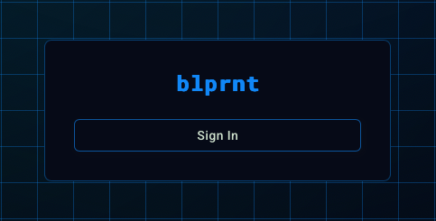
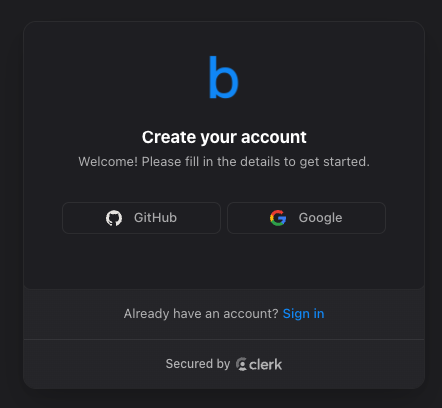

blprnt requires you to login to use the app.

<Note>
  This is to protect your data and ensure you are the only one using your account.
</Note>

<Frame>
  
</Frame>

<Info>
  We currently only support google and github authentication. Email/password and magic link authentication are coming soon.
</Info>

<Frame>
  
</Frame>

<Check>
  We use <a href="https://clerk.com" target="_blank"> clerk </a> for authentication so we don't store any of your personal information on blprnt servers.
</Check>