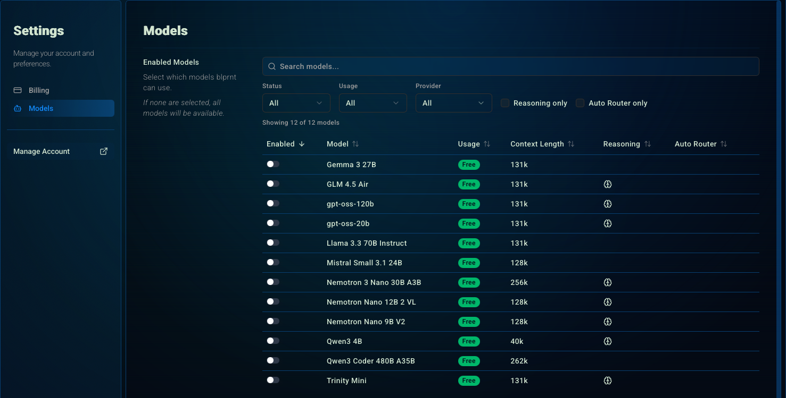
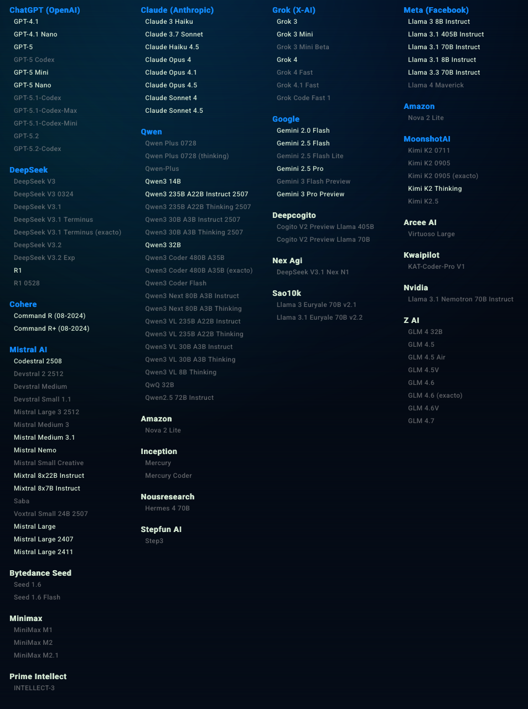

## Models
You can configure which models are available to use for your sessions.
These are the current (as of writing) free models available to use for your sessions.

<Frame>
  
</Frame>

<Tip>
  Purchasing credits will give you **full access** to all the models.
</Tip>

<Note>
  Auto Router models are a curated list of models that, when enabled, allows you to leave the [session model selection](/guides/session/session-settings#changing-the-session-model) blank.
</Note>

### All Models

The models that are highlighted are available to use in the auto-router.
This list is subject to change, the app will always have the latest information while the documentation in not always up to date.

<Frame>
  
</Frame>

## Auto Router
The auto-router is a feature that allows a meta-agent to choose the best model for the request based on the complexity, cost, available, context size, and other factors.

It's a great way to save on costs and get the best performance for your requests.
