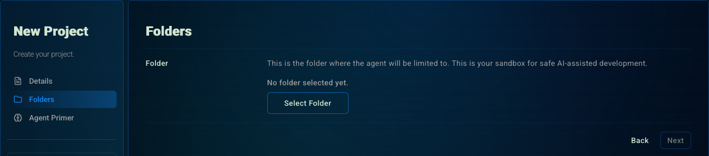
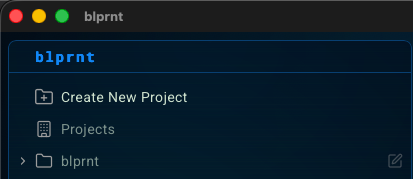
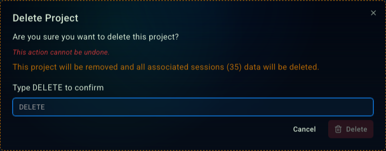

## Creating a new project

<Steps>
  <Step>
    #### Click the 'Create New Project' button
    The button is located in the sidebar.

    <Frame>
      
    </Frame>
  </Step>
  <Step>
    #### Enter the project name
    Give your project a name. Something meaningful and descriptive. This will only be seen by you, not the agent.
    
    <Frame>
      
    </Frame>
  </Step>
  <Step>
    #### Add the project folder
    If this is a new project, create a new folder for it.
    If you're adding blprnt to an exisiting project, point it to the root folder for that project.

    <Frame>
      
    </Frame>

    <Note>
      The project folder is the sandbox the agent can safely write to. It will only be able to manipulate files within this folder.

      Unless you enable [YOLO mode](/guides/session/session-settings#advanced-options) for a session.
    </Note>
  </Step>
  <Step>
    #### Agent Primer (Optional)
    Add an Agent Primer to set default context for every new session.

    This is a great way to set standards, conventions, and guidelines for the agent to follow.

    It's also the place where you can describe your project features, so the agent doesn't have to guess and research every time.
    <Frame>
      
    </Frame>
  </Step>
</Steps>

## Managing projects
<Steps>
  <Step>
    #### Click the 'Edit' button
    The button is located in the sidebar next to the project you want to edit.

    <Frame>
      
    </Frame>
  </Step>
  <Step>
    #### Edit your project

    Edit the project [name](/guides/projects#enter-the-project-name), [folder](/guides/projects#add-the-project-folder), or [agent primer](/guides/projects#agent-primer-optional).

    <Tip>
      All changes are saved automatically. No need to click a save button.
    </Tip>

    <Frame>
      
    </Frame>

    <Warning>
      Changing the project folder can have unexpected side effects for previous sessions. Please be careful.
    </Warning>
  </Step>

  <Step>
    #### Deleting your project
    You can also delete the project by clicking on the 'Delete' button.

    <Danger>
      This will delete all the project's sessions and memories.
    </Danger>

    <Frame>
      
    </Frame>
  </Step>
</Steps>