<Accordion title="Creating a new session">
  <Steps>
    <Step title="Open the blprnt desktop app">
      Click on the 'Create New Session' button in the sidebar.

      <Frame>
        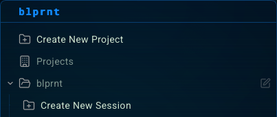
      </Frame>
    </Step>

    <Step title="Enter the session name">
      Enter the session name and click on the 'Create Session' button.

      <Note>
        Make sure to select a model unless you want to default to the auto-router.
      </Note>

      <Frame>
        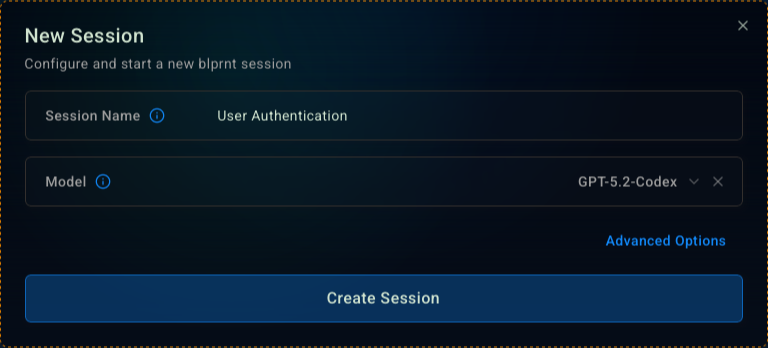
      </Frame>
    </Step>
  </Steps>
</Accordion>

<Accordion title="Interacting with a session">
  <Steps>
    <Step title="Asking the agent to do something">
      Ask the agent to do something by typing your request in the input field.

      <Frame>
        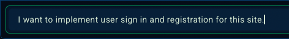
      </Frame>
    </Step>

    <Step title="Agent response">
      The agent will think about your request and then respond to you.

      <Frame>
        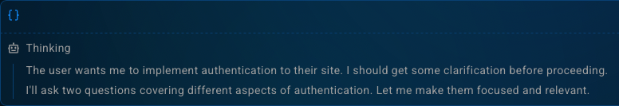
      </Frame>

      <Note>
        If the agent needs clarification, it will ask you questions to help it understand your request better.
      </Note>

      <Frame>
        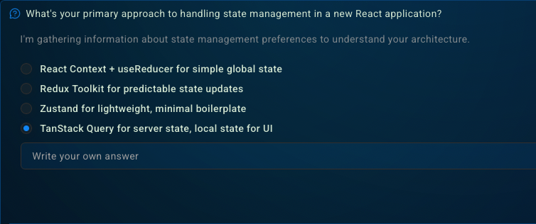
      </Frame>

      <Note>
        You can even write a custom answer to the question if the agent's choices are not what you want.
      </Note>

      <Frame>
        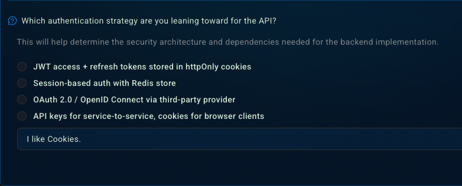
      </Frame>
    </Step>

    <Step title="Creating a plan">
      The agent will create a plan to help you accomplish your request.

      <Frame>
        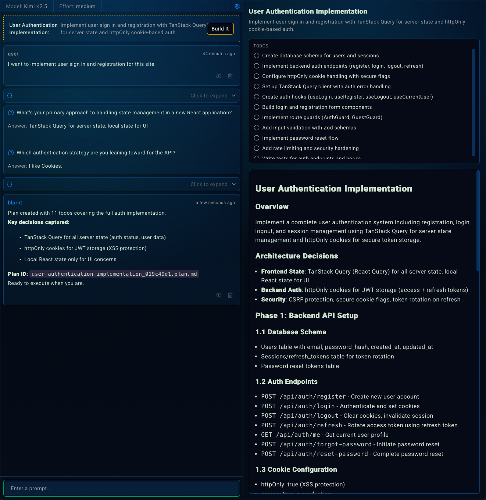
      </Frame>
    </Step>

    <Step title="Executing a plan">
      Click the 'Build It' button to execute the plan.

      <Frame>
        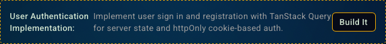
      </Frame>

      <Check>
        The agent will start working on the plan and you will see the plan being executed.
      </Check>

      <Frame>
        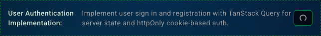
      </Frame>

      <Info>
        This agent has decided to delegate the work to 3 subagents in parallel.
      </Info>

      <Frame>
        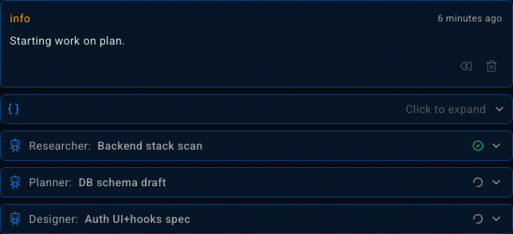
      </Frame>

      <Tip>
        You can see the progress of the plan in the 'Plan' tab.
      </Tip>

      <Frame>
        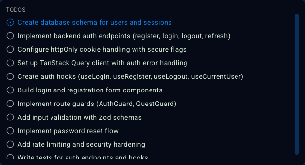
      </Frame>
    </Step>
  </Steps>
</Accordion>