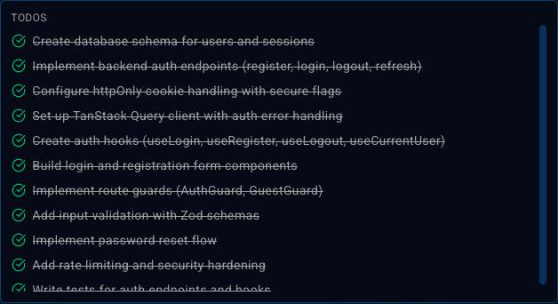
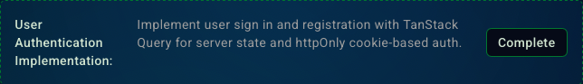

<Steps>
  <Step>
    #### Asking the agent to do something
    Ask the agent to do something by typing your request in the input field.

    <Frame>
      
    </Frame>
  </Step>

  <Step>
    #### Agent response
    The agent will think about your request and then respond to you.

    <Frame>
      
    </Frame>

    <Note>
      If the agent needs clarification, it will ask you questions to help it understand your request better.
    </Note>

    <Frame>
      
    </Frame>

    <Note>
      You can even write a custom answer to the question if the agent's choices are not what you want.
    </Note>

    <Frame>
      
    </Frame>
  </Step>

  <Step>
    #### Creating a plan
    The agent will create a plan to help you accomplish your request.

    <Frame>
      
    </Frame>
  </Step>

  <Step>
    #### Executing a plan
    Click the 'Build It' button to execute the plan.

    <Frame>
      
    </Frame>

    <Check>
      The agent will start working on the plan and you will see the plan being executed.
    </Check>

    <Frame>
      
    </Frame>

    <Check>
      This agent has decided to delegate the work to 3 subagents in parallel.
    </Check>

    <Frame>
      
    </Frame>

    <Check>
      You can see the progress of the plan in the 'Plan' tab.
    </Check>

    <Frame>
      
    </Frame>

    <Check>
      Once the agent completes the plan...
    </Check>

    <Frame>
      
    </Frame>

    <Check>
      You can mark the plan as complete by clicking the 'Complete' button.
    </Check>

    <Frame>
      
    </Frame>
  </Step>
</Steps>
