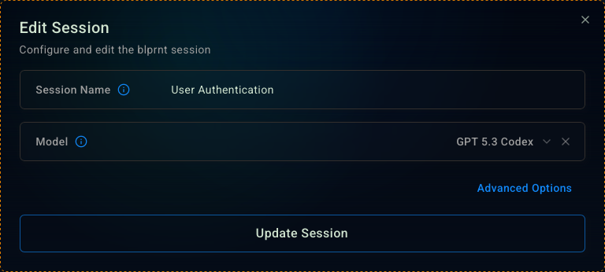
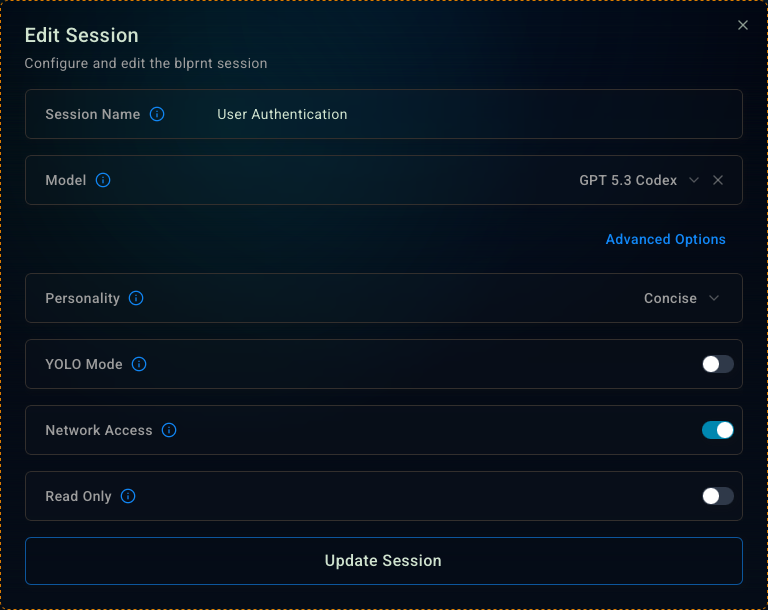
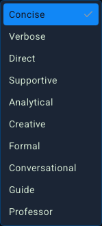

<Steps>
  <Step>
    #### Changing the session name
    The edit button will appear when you hover over the session name in the sidebar.
    <Frame>
      
    </Frame>

    <Tip>
      You can also access the session settings by clicking on the settings button (Cog Wheel) in the top right corner of the session when it's open.
    </Tip>

    <Warning>
      Updating the session while it's running will send an interrupt signal to the agent (and all subagents) and it will stop what it's doing.

      This is a known limitation and we are working on a solution.
    </Warning>
  </Step>

  <Step>
    #### Changing the session model
    You can change the session name and model here.

    <Frame>
      
    </Frame>

    You should switch the session's model in between turns (to avoid interrupting the agent).

    The models in the dropdown are configurable from the [Blprnt Settings](/guides/blprnt-settings) screen.

  </Step>

  <Step>
    #### Advanced Options
    Click the 'Advanced Options' button to access the advanced settings.

    <Frame>
      
    </Frame>

    <Info>
      **Personality:** Definitions below. This affects the tone and output style of the agent. It does not affect the code quality.
    </Info>
    <Warning>
      **YOLO Mode:** If enabled, the agent will have unfiltered access to the filesystem and can make changes to any file on your computer. This is a dangerous mode and should only be enabled if you know what you are doing.
    </Warning>
    <Info>
      **Network Access:** On by default. This allows the agent to use tools that require internet access. e.g. npm install, pip install, etc.
    </Info>
    <Info>
      **Read Only:** This keeps the agent in an even more restricted mode. It will not be able to make any changes to the filesystem. Useful for research and verification or when you want to keep the agent from making changes to the filesystem.
    </Info>
  </Step>

  <Step>
    #### Personalities
    <Frame>
      
    </Frame>

    | Name   | Description |
    |--------|--------|
    | Concise | Gives direct, minimal responses focused purely on action and results. |
    | Verbose | Provides complete, detailed explanations with full context and reasoning. |
    | Direct | Delivers confident, command-like answers without hesitation or filler. |
    | Supportive | Encourages learning through calm, patient, and positive guidance. |
    | Analytical | Breaks problems into logical steps with clear evidence and structure. |
    | Creative | Explores imaginative, unconventional solutions and expressive explanations. |
    | Formal | Communicates with professional precision, structure, and technical accuracy. |
    | Conversational | Speaks naturally and accessibly, like a knowledgeable peer. |
    | Guide | Teaches through clear, step-by-step explanations and practical insight. |
    | Professor | Uses questions and prompts to lead you toward discovering the answer yourself. |
  </Step>
</Steps>