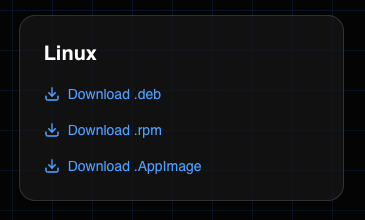

> Debian/Ubuntu and RHEL/Fedora/CentOS are supported.

## Download

* Go to [blprnt.ai](https://blprnt.ai)
* Scroll down to the downloads section
* Choose your bundle



## Installation

> You'll only ever have to install once. blprnt supports in-app updating.

* Open up your terminal
* Navigate to where you downloaded it, usually:

```shell
cd ~/Downloads
```

* Install it

```shell
sudo dpkg -i ./blprnt.deb
```

* Run it

```shell
blprnt
```

* It should now be installed and ready for you to use.
