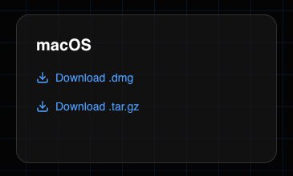
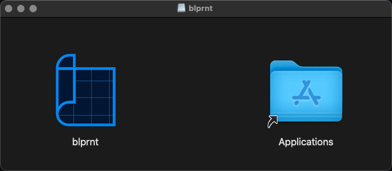

> Both a `.dmg` bundle and a compressed tar are provided.

## Download

* Go to [blprnt.ai](https://blprnt.ai)
* Scroll down to the downloads section
* Choose your bundle

*Recommended:* Choose the `.dmg` extension

## Installation

> You'll only ever have to install once. blprnt supports in-app updating.

* Open your downloads folder in Finder
* Find the `blprnt.dmg` and open it
* A new window will come up with the `blprnt` icon and your Applications folder

* Drag `blprnt` into your Applications folder
* It should now be installed and ready for you to use.
