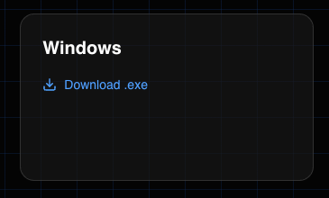
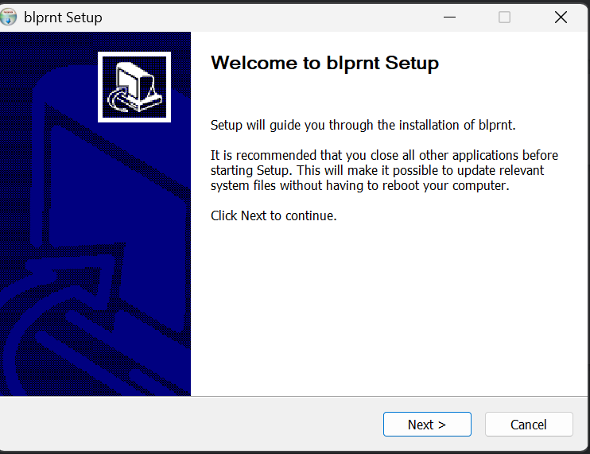
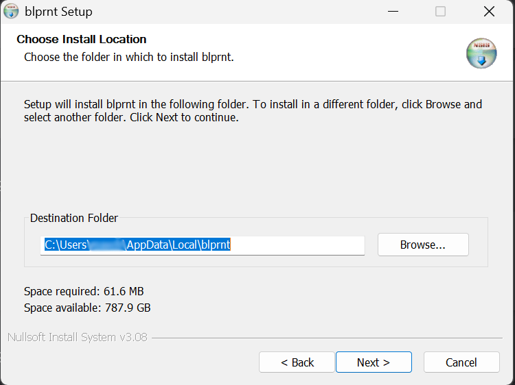
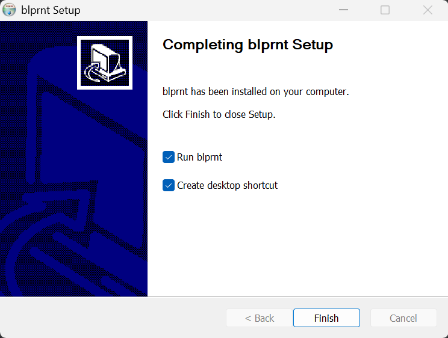

> The windows version has some limitations which are actively being worked on. 
> If you're comfortable enough, install the [linux](/install/linux) debian version on WSL.

## Download

> You'll only ever have to install once. blprnt supports in-app updating.

* Go to [blprnt.ai](https://blprnt.ai)
* Scroll down to the downloads section

## Installation

* Open up file explorer and go to your Downloads folder
* Double click `blprnt` (or `blprnt.exe`)
* Go through the installation wizard
* 
* 
* 
* It should now be installed and ready for you to use.
